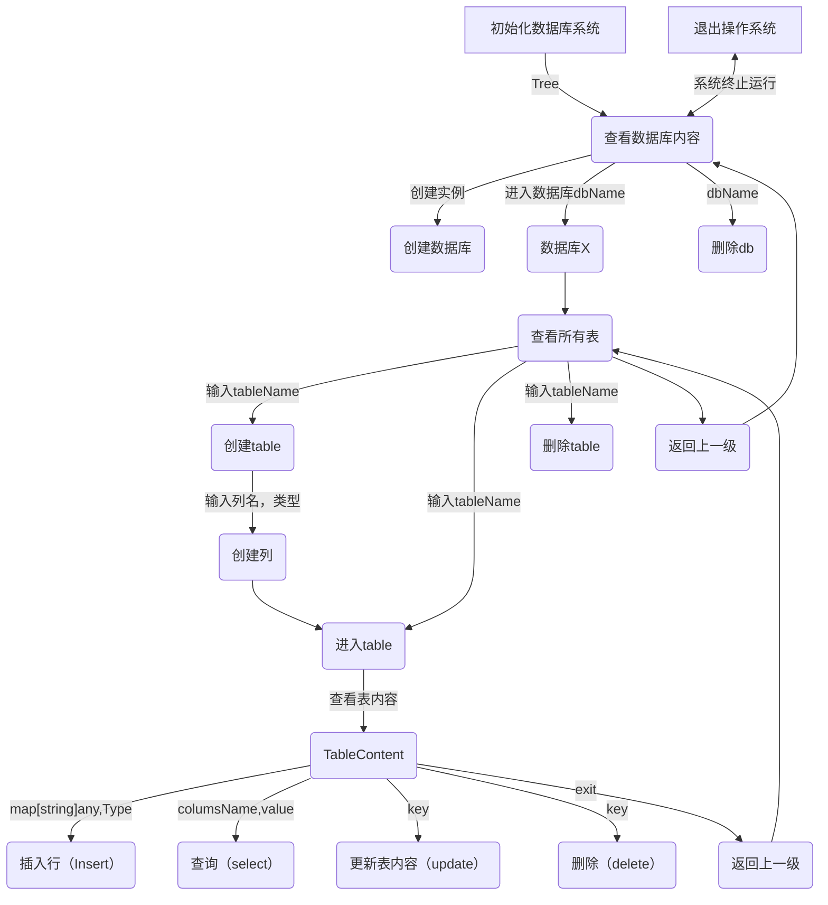

```mermaid
graph TD
    A[初始化数据库系统]
    A0[退出操作系统]
    A -->|Tree| A1(查看数据库内容)
    A1 -->|创建实例| B(创建数据库)
    A0 <-->|系统终止运行| A1 
    A1 -->|进入数据库dbName| D(数据库X)
    A1 -->|dbName|E(删除db)
    D --> D1(查看所有表)
    D1 -->|输入tableName| D3(创建table)
    D1 -->|输入tableName| D4(进入table)
    D1 -->|输入tableName| D5(删除table)
    D1 --> D0(返回上一级)
    D0 --> A1
    D3 -->|输入列名，类型| F(创建列)
    F  --> D4
    D4 --> |查看表内容|F1(TableContent)
    F1 -->|"map[string]"any,Type| G(插入行（Insert）)
    F1 -->|columsName,value|G1(查询（select）)
    F1 -->|"key"| H(更新表内容（update）)
    F1 -->|"key"| H0(删除（delete）)
    G2 --> D1
    F1 -->|exit| G2(返回上一级)

```
